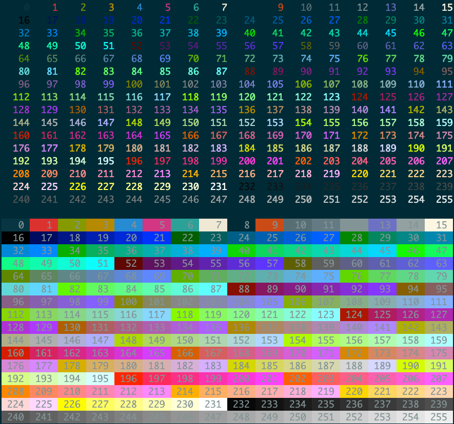

## My dotfiles

### Installation
    bash install.sh [-a]

`-a`: install all. (The script will install everything without prompts.)

### Coloring

Use [the script](https://gist.github.com/hsiuhsiu/9843f31873a4cb28aa820c83cd82db3c) to see the coloring. Or execute the following command.

    bash <(curl -Ls https://gist.githubusercontent.com/hsiuhsiu/9843f31873a4cb28aa820c83cd82db3c/raw/2fdf40e4fcb0bfcda32fa39b6660145d7eadeb52/color.sh)

Example result:

