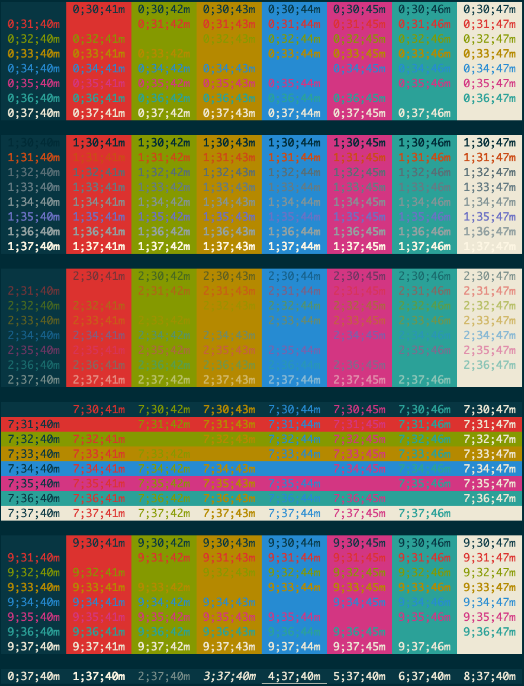

# My dotfiles

It includes my config files for

- vim
- tmux
- bash
- zsh
- git
- cmqlstyle

## Setup (by [dotbot](https://github.com/anishathalye/dotbot))

Run `./install`.

Note that the following files will be overwirte. Backup them if necessary

- `~/.gitignore_global`
- `~/.tmux.conf`
- `~/.vim`
- `~/.vimrc`
- `~/.cmqlstyle.css`

### Shell
Use oh-my-zsh and the romkatv/powerlevel10k theme instead

### Git

`.gitconfig` example to have multiple user/email settings

```
[include]
	path = ~/dotfiles/git/common.gitconfig
[includeIf "gitdir:~/work/"]
	path = .work.gitconfig
[includeIf "gitdir:~/personal/"]
	path = .personal.gitconfig
```

## Coloring Cheatsheet

Use [the script](https://gist.github.com/hsiuhsiu/9843f31873a4cb28aa820c83cd82db3c) to see the coloring. Or execute the following command.

    bash <(curl -Ls https://gist.githubusercontent.com/hsiuhsiu/9843f31873a4cb28aa820c83cd82db3c/raw/2fdf40e4fcb0bfcda32fa39b6660145d7eadeb52/color.sh)

Example result:


